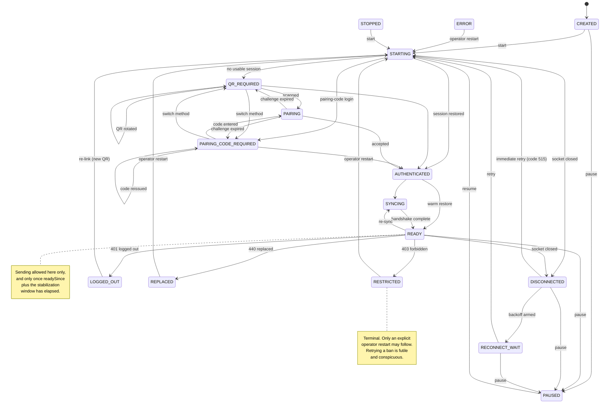

# Instance states

Every WhatsApp number the gateway manages is an "instance", and every instance
is in exactly one of sixteen states at any moment.

The list is verified against two places in the source that must agree:

- the `InstanceState` enum in `prisma/schema.prisma`
- `INSTANCE_STATES` in `src/types/index.ts`

---

## The short version

- **Only `READY` can send**, and only after a settling period.
- Five states recover on their own. The rest need someone to act.
- `LOGGED_OUT`, `REPLACED` and `RESTRICTED` stop retrying **on purpose**.
  Reconnecting after a logout or a ban cannot work, and trying repeatedly is
  conspicuous to WhatsApp.

---

## The sixteen states

### Getting connected

| State | In plain language |
|---|---|
| `CREATED` | The gateway knows about this number, but has never tried to connect it. Nothing is running. This is where every instance starts. |
| `STARTING` | Opening a connection right now. A brief step — it moves on within seconds. |
| `QR_REQUIRED` | Waiting for someone to scan a QR code with the phone. The code is stored on the instance and Laravel reads it. Codes expire and are replaced automatically. |
| `PAIRING_CODE_REQUIRED` | Waiting for someone to type a pairing code into the phone. The alternative to scanning. |
| `PAIRING` | The code was used and the link is being completed. Another brief step. |
| `AUTHENTICATED` | WhatsApp accepted the login. The session exists, but the connection is not finished setting up. Not usable yet. |
| `SYNCING` | Catching up on state from WhatsApp. Nearly there. Still not usable. |

### Working

| State | In plain language |
|---|---|
| `READY` | Connected and working. **The only state that can send** — and see the settling period below. |

### Trouble

| State | In plain language |
|---|---|
| `DISCONNECTED` | The connection dropped for a reason that usually fixes itself. The gateway will try again. Normally recovers with no help. |
| `RECONNECT_WAIT` | Waiting out a delay before the next attempt. The wait grows after each failure, so a service having a bad day is not hammered. |

### Stopped by someone

| State | In plain language |
|---|---|
| `PAUSED` | Deliberately taken out of service by an operator or by Laravel. Not sending. The session is kept, so resuming needs no QR. |
| `STOPPED` | Shut down deliberately. Will not reconnect on its own. Someone must start it. |

### Cannot continue

| State | In plain language |
|---|---|
| `LOGGED_OUT` | The number was unlinked — usually someone removed the linked device from the phone. **A new QR scan is required.** The gateway does not retry, because retrying cannot work. |
| `REPLACED` | Another WhatsApp session took over this number. Often the same number linked somewhere else. The gateway steps aside rather than fighting the user's own device for the connection. |
| `RESTRICTED` | WhatsApp has refused this account. Usually a ban or a restriction. The gateway stops. No amount of reconnecting changes this, and repeated attempts make it worse. |
| `ERROR` | Something went wrong that automatic retries will not fix — a corrupted session, or a device mismatch. Needs a human. Usually ends in a re-link. |

---

## Which states recover on their own

Verified against `RECOVERABLE_STATES` and `TERMINAL_STATES` in
`src/types/index.ts`.

**Recover on their own** — the gateway keeps working on these without help:

`STARTING`, `AUTHENTICATED`, `SYNCING`, `DISCONNECTED`, `RECONNECT_WAIT`

**Terminal** — nothing further happens until Laravel or an operator acts:

`LOGGED_OUT`, `REPLACED`, `RESTRICTED`, `STOPPED`

**Neither list** — `CREATED`, `QR_REQUIRED`, `PAIRING_CODE_REQUIRED`,
`PAIRING`, `READY`, `PAUSED`, `ERROR`.

That is not an oversight, but the reasons differ:

- `CREATED`, `QR_REQUIRED`, `PAIRING_CODE_REQUIRED` and `PAIRING` are waiting
  for a person, not for the network.
- `READY` is the working state; there is nothing to recover from.
- `PAUSED` is deliberate. Its only exit is `STARTING`, via resume.
- `ERROR` is the one worth understanding. It is **not** in the `TERMINAL_STATES`
  list, but it behaves like one: the disconnect reasons that lead to it are
  marked not recoverable, so no automatic retry is scheduled, and the only
  transition out of `ERROR` is `STARTING`. In practice, treat it as needing a
  human. See `DISCONNECT_REASONS.md`.

---

## When can a number send

Three conditions, all required (`isSendable` in
`src/instances/instance-state-machine.ts`):

1. The state is `READY`.
2. A `readySince` timestamp is recorded.
3. The settling period has fully elapsed since that timestamp.

The settling period is `INSTANCE_STABILIZATION_SECONDS` in `.env`, 60 seconds
by default.

`READY` alone is not enough. Immediately after a link opens, WhatsApp is still
delivering app-state, contacts and chat history; sending into that window is
what gets numbers flagged. Sixty seconds of patience is cheap; a restricted
number is not.

A `readySince` in the future — from clock skew or a bad write — yields a
negative elapsed time and therefore `false`. The conservative answer is the
deliberate one.

Separately, `pause` clears the instance's `enabled` flag, which blocks sending
outright regardless of state.

**No other state can send.** Not `SYNCING`, not `AUTHENTICATED`, not
`DISCONNECTED`. A send attempted against any of them is refused with 409
`instance_not_sendable` rather than queued, and it is never rerouted to another
number.

---

## The rules the graph enforces

The transitions are written down in `ALLOWED_TRANSITIONS`
(`src/instances/instance-state-machine.ts`), so an illegal move is impossible
rather than merely unlikely. Four rules are worth knowing:

1. **`READY` is reachable only from `SYNCING` or `AUTHENTICATED`.** `READY`
   authorises sending, so it must be earned through a completed handshake —
   never assumed because a socket happened to open. There is no
   `PAUSED -> READY` shortcut: pausing closes the socket, so resuming replays
   the whole handshake.
2. **`LOGGED_OUT`, `REPLACED` and `RESTRICTED` are terminal.** Their only exit
   is `STARTING`, and only an operator can ask for it. Automatic retry there is
   futile and conspicuous to WhatsApp.
3. **`RECONNECT_WAIT` is reachable only from `DISCONNECTED`**, so the backoff
   timer can only ever be armed by an actual socket close.
4. **`ERROR` and `STOPPED` are reachable from everywhere.** `ERROR` records a
   fault, `STOPPED` is the operator's off switch. Neither is a resumption, so
   neither weakens rule 2.

`QR_REQUIRED` and `PAIRING_CODE_REQUIRED` may transition to themselves.
WhatsApp rotates the QR every few seconds and each rotation is a genuine repeat
of the same state.

## How states move

Every state may also move to `ERROR` or `STOPPED`; those edges are omitted from
the diagram to keep it readable.

Read alongside the diagram:

- Every state except the sink itself may also move to `ERROR` or `STOPPED`.
- `LOGGED_OUT`, `REPLACED` and `RESTRICTED` can be reached from any state that
  owns or is negotiating a connection — `STARTING`, `QR_REQUIRED`,
  `PAIRING_CODE_REQUIRED`, `PAIRING`, `AUTHENTICATED`, `SYNCING`, `READY`,
  `DISCONNECTED`, `RECONNECT_WAIT` and `PAUSED`. Those outcomes are discovered
  from the disconnect code rather than reached by design, which is why the
  diagram shows them only from `READY`.
- `PAUSED` is reachable from every non-terminal state, not only the four edges
  drawn.
- A restart is `STOPPED` and then `STARTING`, not `READY -> STARTING`. That
  intermediate step exists because `STARTING` is not legal out of `READY`: a
  live session must be observed to end before a new one begins.

---

## What to do in each state

| State | Action |
|---|---|
| `CREATED` | Start it, from Eagleto. |
| `STARTING` | Wait. If it sits here for minutes, check the logs. |
| `QR_REQUIRED` | Scan the code. |
| `PAIRING_CODE_REQUIRED` | Enter the code on the phone. |
| `PAIRING` | Wait. |
| `AUTHENTICATED` | Wait. |
| `SYNCING` | Wait. |
| `READY` | Nothing. This is the goal. |
| `DISCONNECTED` | Wait — it retries. If it repeats all day, check the network and any proxy. |
| `RECONNECT_WAIT` | Wait. If it never leaves, see `RECOVERY_PLAYBOOK.md`. |
| `PAUSED` | Resume it when you are ready. |
| `LOGGED_OUT` | Link the number again with a new QR. |
| `REPLACED` | Find the other session using this number and close it, then start again. |
| `RESTRICTED` | Stop using this number. Read section 11 of the README. |
| `ERROR` | Read the error on the instance. Usually a re-link. |
| `STOPPED` | Start it when you want it back. |
